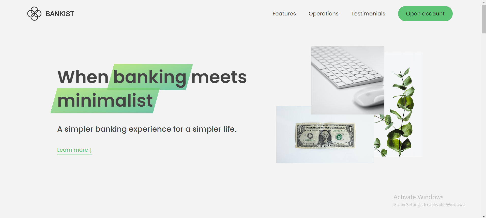
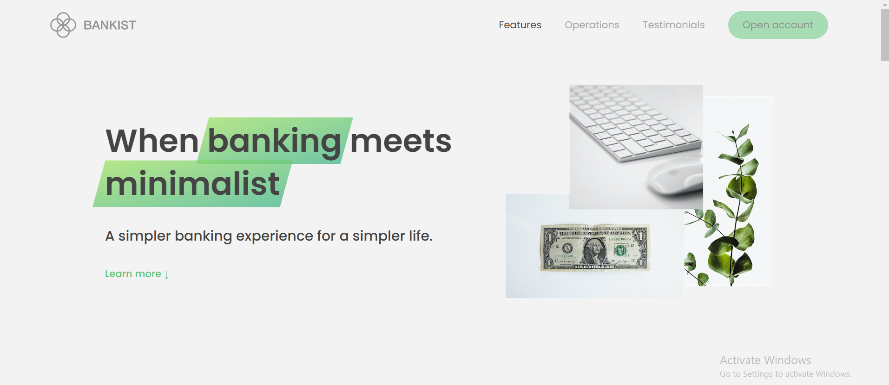
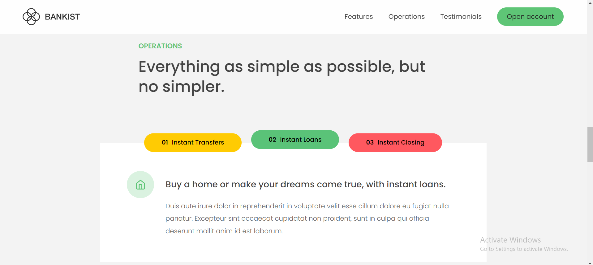
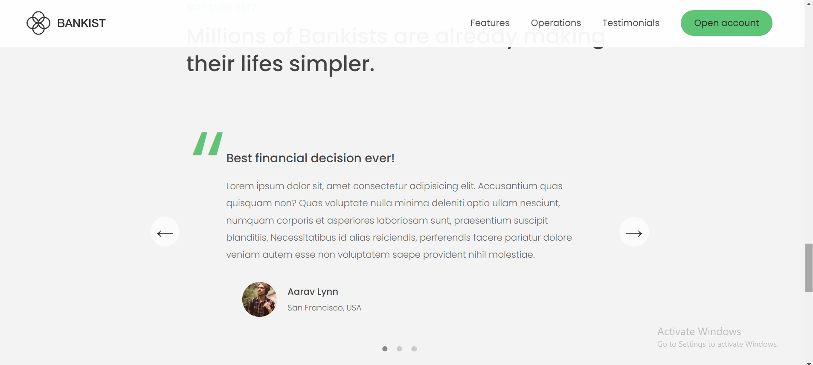

# Bankist-Webpage
A modern bank website
This is one of my dearest project so far. A modern, minimalist webpage that has the most common modern features implemented in a webpage, like: Modal Window, Smoooth Scrolling (using window.scrollTo() with section coordonates or the modern way, section.scrolIntoView()), Tabbed Component, Menu Fade Animation, Sticky navigation: Intersection Observer API and Intersection Observer API for Revealing Sections,  Lazy Loading Images for code functionality improvement, Slider Component and implementing other features using Event Delegation. 
I developed this project following my Udemy "The Complete JavaScript Course: from zero to Expert" by Jonas S. 

Here are some SCREENSHOTS to see my project:

